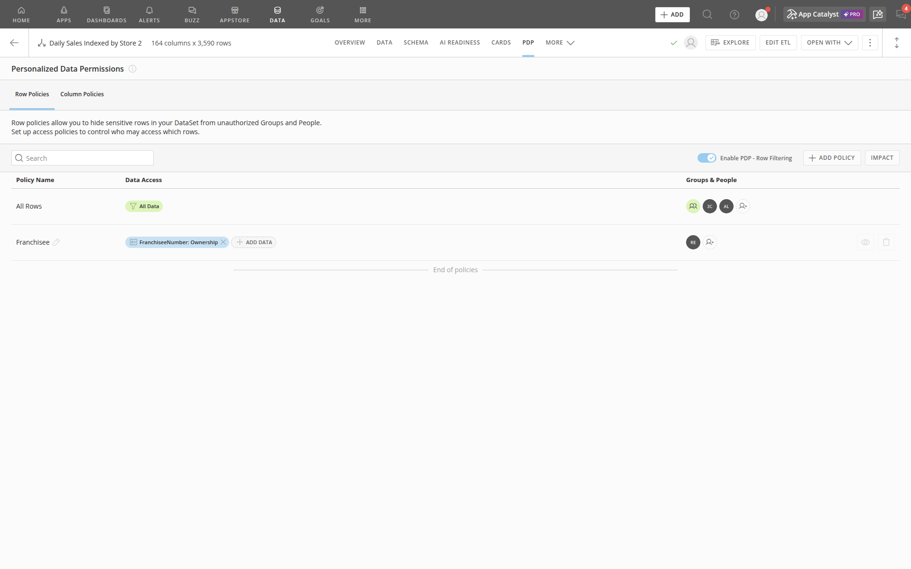

# PDP Policy Inventory — Live Capture

<div class="cover-meta">

**Apps:** REGIS FRANCHISEE APP (primary), REGIS APP (reference)  
**Document type:** Shared cross-app reference  
**Audience:** PDP / access owners, app owners, support staff  
**Domo instance:** https://regiscorp.domo.com  
**Last updated:** 2026-07-13  
**Author / owner:** _TBD — PDP / access owner_

</div>

## Purpose

This document records **live Personalized Data Permission (PDP) row policies** captured from regiscorp.domo.com on 2026-07-13 while signed in as Jeff Hart (Admin). It supplements **PDP overview and testing** with exact policy names, groups, filter columns, and dataset IDs.

For **how PDP ties together** — Domo groups, custom attributes (**Ownership**, **Territory**), and dynamic row filters — see the architecture section in [PDP overview and testing](./pdp-overview-and-testing.md#pdp-architecture-groups-custom-attributes-and-row-policies).

## How to open PDP in Domo

| Step | Action |
| --- | --- |
| 1 | **Data** → search for the dataset (e.g. **Daily Sales Master 2**) |
| 2 | Open the dataset → select the **PDP** tab |
| 3 | Confirm **Row Policies** sub-tab; toggle **Enable PDP - Row Filtering** should be **ON** |

Direct URL pattern:

```
https://regiscorp.domo.com/datasources/{dataset-id}/details/rls
```

> **Note:** Older documentation paths such as `/admin/personalizeddata` and `/page/datacenter/pdp/{id}` do not work on this Domo instance. Use the dataset **PDP** tab or `/details/rls` instead.

## Daily Sales Master 2 (primary franchisee dataset)

This is the dataset referenced by app filter labels ("Source: Daily Sales Master 2") and the main PDP scope for REGIS FRANCHISEE APP.

| Item | Value |
| --- | --- |
| **Domo dataset name** | Daily Sales Master 2 |
| **Dataset ID** | `8d851507-f995-4918-abc8-90032b2eff65` |
| **Type** | DataFlow output |
| **Owner** | Jeff Hart |
| **Scale** | 204 columns · 1,513,506 rows (as of 2026-07-13) |
| **PDP status** | **Enabled** — Row Filtering ON |
| **PDP URL** | https://regiscorp.domo.com/datasources/8d851507-f995-4918-abc8-90032b2eff65/details/rls |


### Row policies

| Policy name | Type | Data access / filter | Groups & people | Notes |
| --- | --- | --- | --- | --- |
| **All Rows** | Open (all data) | All Data | All Admins and DataSet Owners; **3c090c15-223e-4377-bf0f-60e2eec980b4** (3 people); **AllDataAccess** (49 people) | For users that can access all salons without restriction |
| **Franchisee** | User (filtered) | `FranchiseeNumber` **EQUALS** `Ownership` (dynamic) | **RestrictedDataAccess** (15 people) | Restricted users based on Ownership / franchisee association |

### Franchisee policy detail

The **Franchisee** policy uses **Dynamic PDP**:

| Filter component | Value |
| --- | --- |
| Column | `FranchiseeNumber` |
| Operator | EQUALS |
| Value type | **DYNAMIC** |
| Dynamic attribute | **Ownership** |

Domo resolves each user's **Ownership** attribute at login and filters rows where `FranchiseeNumber` matches that value. Franchisee users in **RestrictedDataAccess** therefore see only salons tied to their ownership / franchisee entity.

### Domo groups referenced (Daily Sales Master 2)

| Group name | Group ID | Approx. members | Role in PDP |
| --- | --- | --- | --- |
| **AllDataAccess** | `2014419418` | 49 | Full row access via **All Rows** policy |
| **RestrictedDataAccess** | `950576281` | 15 | Franchisee-scoped access via **Franchisee** policy |
| **3c090c15-223e-4377-bf0f-60e2eec980b4** | `1197243980` | 3 | Full row access via **All Rows** policy (internal / test group name is a UUID) |

Test accounts visible in dataset sharing include **Jeff Franchisee** and **Jeff Territory** — useful for PDP validation.

## Daily Sales Master (legacy dataset — not the app primary)

The older **Daily Sales Master** dataset (without "2") is a separate DataFlow output. REGIS APP and REGIS FRANCHISEE APP cards reference **Daily Sales Master 2**, not this dataset. PDP on this legacy dataset is documented for completeness.

| Item | Value |
| --- | --- |
| **Domo dataset name** | Daily Sales Master |
| **Dataset ID** | `19ae8295-9dab-4277-963a-f9c7aab23f78` |
| **Owner** | Keela Davis |
| **Scale** | 180 columns · 1,430,571 rows |
| **Tags** | PROD, PDP |
| **PDP URL** | https://regiscorp.domo.com/datasources/19ae8295-9dab-4277-963a-f9c7aab23f78/details/rls |

### Row policies (Daily Sales Master)

| Policy name | Type | Data access / filter | Groups & people |
| --- | --- | --- | --- |
| **All Rows** | Open | All Data | **AllDataAccess** (`2014419418`) |
| **TerritoryDataAccess** | User (filtered) | `Alline_territory` **EQUALS** `Territory` (dynamic) | **TerritoryDataAccess** (`1547677730`) |

This territory-scoped policy supports corporate territory leaders, not franchisee app users.

## domo_regis.MonthlyMetrics (scorecard upstream input)

Warehouse-fed monthly metrics dataset used as an input to **Store Scorecard by Brand ETL**. PDP on this dataset uses the **same franchisee pattern** as Daily Sales Master 2.

| Item | Value |
| --- | --- |
| **Domo dataset name** | domo_regis.MonthlyMetrics |
| **Dataset ID** | `f303a86a-67b5-49fa-8874-195eab30506c` |
| **Owner** | Jeff Hart |
| **Scale** | 117 columns · 47,479 rows |
| **Tags** | PROD, PDP |
| **PDP status** | **Enabled** — Row Filtering ON |
| **PDP URL** | https://regiscorp.domo.com/datasources/f303a86a-67b5-49fa-8874-195eab30506c/details/rls |


### Row policies (domo_regis.MonthlyMetrics)

| Policy name | Type | Data access / filter | Groups & people | Notes |
| --- | --- | --- | --- | --- |
| **All Rows** | Open (all data) | All Data | All Admins and DataSet Owners; **3c090c15-223e-4377-bf0f-60e2eec980b4** (3 people); **AllDataAccess** (49 people) | For users that can access all salons without restriction |
| **Franchisee** | User (filtered) | `FranchiseeNumber` **EQUALS** `Ownership` (dynamic) | **RestrictedDataAccess** (15 people) | Restricted users based on Ownership / franchisee association |

Scorecard app pages consume **Store Scorecard Data_Brand Peers** (ETL output), not this dataset directly — but franchisee PDP on scorecard pages depends on aligned policies across the scorecard lineage (MonthlyMetrics → ETL → Store Scorecard Data_Brand Peers).

## domo_regis.FactDailySales (warehouse sales fact)

Upstream warehouse fact table feeding **Daily Sales ETL 2** (and legacy Daily Sales ETL). PDP uses the same franchisee pattern as Daily Sales Master 2.

| Item | Value |
| --- | --- |
| **Domo dataset name** | domo_regis.FactDailySales |
| **Dataset ID** | `5bdaf9aa-0950-432e-a9ce-eaa7cffb2796` |
| **Owner** | Keela Davis |
| **Scale** | 145 columns · 1,513,506 rows |
| **Tags** | PROD, PDP |
| **PDP status** | **Enabled** — Row Filtering ON |
| **PDP URL** | https://regiscorp.domo.com/datasources/5bdaf9aa-0950-432e-a9ce-eaa7cffb2796/details/rls |


### Row policies (domo_regis.FactDailySales)

| Policy name | Type | Data access / filter | Groups & people | Notes |
| --- | --- | --- | --- | --- |
| **All Rows** | Open (all data) | All Data | All Admins and DataSet Owners; **3c090c15-223e-4377-bf0f-60e2eec980b4** (3 people); **AllDataAccess** (49 people) | For users that can access all salons without restriction |
| **Franchisee** | User (filtered) | `FranchiseeNumber` **EQUALS** `Ownership` (dynamic) | **RestrictedDataAccess** (15 people) | Restricted users based on Ownership / franchisee association |

This is the root sales fact in the Daily Sales lineage. If franchisee users can query this dataset directly (outside app cards), the same **Franchisee** policy applies.

## Daily Sales Unpivoted Services 2 (ETL derivative)

Service-type breakdown dataset output from **Daily Sales ETL 2**. Not a primary REGIS app card source, but PDP is enabled with the standard franchisee pattern.

| Item | Value |
| --- | --- |
| **Domo dataset name** | Daily Sales Unpivoted Services 2 |
| **Dataset ID** | `e8d85e2e-6464-40d2-b4e4-a2f138de815d` |
| **Owner** | Jeff Hart |
| **Scale** | 35 columns · 12,108,048 rows |
| **Tags** | PDP |
| **PDP status** | **Enabled** — Row Filtering ON |
| **PDP URL** | https://regiscorp.domo.com/datasources/e8d85e2e-6464-40d2-b4e4-a2f138de815d/details/rls |


### Row policies (Daily Sales Unpivoted Services 2)

| Policy name | Type | Data access / filter | Groups & people | Notes |
| --- | --- | --- | --- | --- |
| **All Rows** | Open (all data) | All Data | All Admins and DataSet Owners; **3c090c15-223e-4377-bf0f-60e2eec980b4** (3 people); **AllDataAccess** (49 people) | For users that can access all salons without restriction |
| **Franchisee** | User (filtered) | `FranchiseeNumber` **EQUALS** `Ownership` (dynamic) | **RestrictedDataAccess** (15 people) | Restricted users based on Ownership / franchisee association |

## DSM2 - Daily Sales By Traffic (ETL derivative)

Traffic-based sales split dataset output from **Daily Sales ETL 2**. Not a primary REGIS app card source, but PDP is enabled with the standard franchisee pattern.

| Item | Value |
| --- | --- |
| **Domo dataset name** | DSM2 - Daily Sales By Traffic |
| **Dataset ID** | `b5bac1e5-bd22-47b9-b8de-a19bc0237de0` |
| **Owner** | Jeff Hart |
| **Scale** | 23 columns · 4,540,518 rows |
| **Tags** | PDP |
| **PDP status** | **Enabled** — Row Filtering ON |
| **PDP URL** | https://regiscorp.domo.com/datasources/b5bac1e5-bd22-47b9-b8de-a19bc0237de0/details/rls |


### Row policies (DSM2 - Daily Sales By Traffic)

| Policy name | Type | Data access / filter | Groups & people | Notes |
| --- | --- | --- | --- | --- |
| **All Rows** | Open (all data) | All Data | All Admins and DataSet Owners; **3c090c15-223e-4377-bf0f-60e2eec980b4** (3 people); **AllDataAccess** (49 people) | For users that can access all salons without restriction |
| **Franchisee** | User (filtered) | `FranchiseeNumber` **EQUALS** `Ownership` (dynamic) | **RestrictedDataAccess** (15 people) | Restricted users based on Ownership / franchisee association |

## Store Scorecard Data_Brand Peers (scorecard ETL output)

Scorecard dataset output from **Store Scorecard by Brand ETL**. Powers **Store Performance Report Card** and **Store Performance Scorecard** in both apps (there is no separate “Store Scorecard Data” dataset).

| Item | Value |
| --- | --- |
| **Domo dataset name** | Store Scorecard Data_Brand Peers |
| **Dataset ID** | `41cb7308-2860-431e-92ca-7b63049b8ce9` |
| **Owner** | Jeff Hart |
| **Scale** | 112 columns · 42,252 rows |
| **Tags** | PROD, PDP |
| **PDP status** | **Enabled** — Row Filtering ON |
| **PDP URL** | https://regiscorp.domo.com/datasources/41cb7308-2860-431e-92ca-7b63049b8ce9/details/rls |


### Row policies (Store Scorecard Data_Brand Peers)

| Policy name | Type | Data access / filter | Groups & people | Notes |
| --- | --- | --- | --- | --- |
| **All Rows** | Open (all data) | All Data | All Admins and DataSet Owners; **3c090c15-223e-4377-bf0f-60e2eec980b4** (3 people); **AllDataAccess** (49 people) | For users that can access all salons without restriction |
| **Franchisee** | User (filtered) | `FranchiseeNumber` **EQUALS** `Ownership` (dynamic) | **RestrictedDataAccess** (15 people) | Restricted users based on Ownership / franchisee association |

## Daily Sales Indexed by Store 2 (indexing ETL output)

Indexed store performance dataset output from **Daily Sales Master Indexing 2**. Used by indexed performance cards on both apps.

| Item | Value |
| --- | --- |
| **Domo dataset name** | Daily Sales Indexed by Store 2 |
| **Dataset ID** | `0239c170-55d5-43e1-9a92-a3498ba68548` |
| **Owner** | Jeff Hart |
| **Scale** | 164 columns · 3,590 rows |
| **Tags** | PROD, PDP |
| **PDP status** | **Enabled** — Row Filtering ON |
| **PDP URL** | https://regiscorp.domo.com/datasources/0239c170-55d5-43e1-9a92-a3498ba68548/details/rls |



### Row policies (Daily Sales Indexed by Store 2)

| Policy name | Type | Data access / filter | Groups & people | Notes |
| --- | --- | --- | --- | --- |
| **All Rows** | Open (all data) | All Data | All Admins and DataSet Owners; **3c090c15-223e-4377-bf0f-60e2eec980b4** (3 people); **AllDataAccess** (49 people) | For users that can access all salons without restriction |
| **Franchisee** | User (filtered) | `FranchiseeNumber` **EQUALS** `Ownership` (dynamic) | **RestrictedDataAccess** (15 people) | Restricted users based on Ownership / franchisee association |

## Datasets without PDP

| Dataset | Domo / logical name | PDP | Notes |
| --- | --- | --- | --- |
| Salon dimension | **DimSalon** / **domo_regis.MonthlySalonCounts** | **No** | ETL input only; franchisee scoping on downstream datasets |

## Dataset-level capture complete

All PDP-enabled datasets used by REGIS APP and REGIS FRANCHISEE APP have been documented. Policies follow the standard **All Rows** + **Franchisee** pattern unless noted (legacy Daily Sales Master adds **TerritoryDataAccess**).

## API reference (for automation)

Internal Domo API used by the PDP UI (session cookie auth):

```
GET /api/query/v1/data-control/{dataset-id}/filter-groups?options=load_associations,include_open_policy,load_filters,sort&paginate=true&limit=50&offset=0
```

Returns policy names, group IDs, and filter parameters. Standard sharing permissions (not PDP) are at:

```
GET /api/data/v3/datasources/{dataset-id}/permissions
```

## Change management

When adding a franchisee user:

1. Add the user to **RestrictedDataAccess** (or a franchisee-specific group covered by the **Franchisee** policy).
2. Set the user's **Ownership** attribute to the correct franchisee identifier (must match `FranchiseeNumber` values in Daily Sales Master 2).
3. Test in REGIS FRANCHISEE APP per **PDP overview and testing**.

When a salon changes franchisee ownership:

1. Update upstream salon master / DimSalon.
2. Re-run **Daily Sales ETL 2**.
3. Confirm `FranchiseeNumber` values in Daily Sales Master 2 reflect the change.
4. Re-test affected franchisee users.

## Related topics

- [PDP overview and testing](./pdp-overview-and-testing.md)
- [Daily Sales Master 2 data source guide](../apps/regis-app/data-sources/daily-sales-master-2.md)
- [Franchisee PDP troubleshooting](../apps/regis-franchisee-app/maintenance/pdp-troubleshooting.md)
- [Shared dataset inventory](./dataset-inventory.md)
